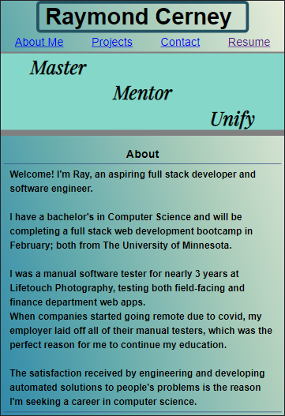
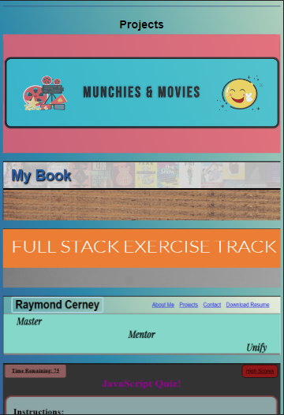
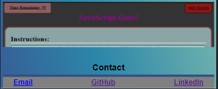

# React Portfolio

## Details:
My portfolio, but using React!
## Tools Used:

- VSCode
- JavaScript
- Node.JS
- React

## Website:

https://react-portfolio-rc.herokuapp.com/

### Previews:

### Author:

Raymond Cerney

### License

This project is licensed under [MIT](https://opensource.org/licenses/MIT)

### Contact:

cerne004@gmail.com

LinkedIn: https://www.linkedin.com/in/raymondcerney/
